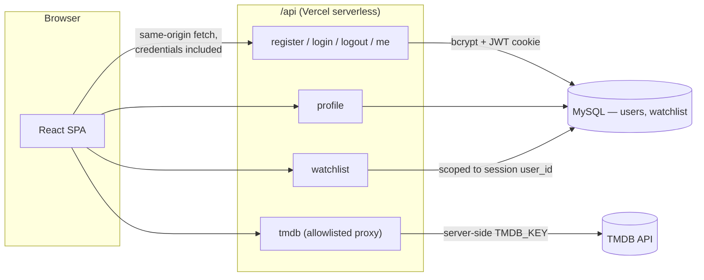
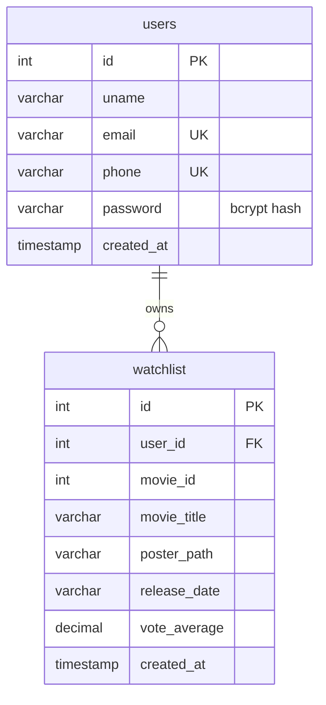

# CineVault

A full-stack movie discovery and watchlist platform: real authentication (bcrypt + JWT session cookies), a MySQL-backed user and watchlist store, and a live movie catalog from [TMDB](https://www.themoviedb.org/) — trending, popular, top-rated, genre discovery, search, and a full details experience with cast, trailers, and recommendations.

**CineVault is an independent portfolio project. It is not affiliated with, endorsed by, or associated with Netflix, TMDB, or any streaming service** — the name, palette, and layout are original.

## Overview

Most "movie browser" tutorial projects stop at fetching a list from an API and rendering cards. CineVault goes further: it's a complete authenticated application where a signed-in user's watchlist is real, persistent, server-validated state — not a `localStorage` toy. The goal was to build something that demonstrates actual full-stack engineering: a secure session model, a real relational schema with foreign keys and unique constraints, a hardened external-API proxy, and a test suite that exercises the backend logic directly (not just the UI).

## Key Features

- **Movie discovery** — trending, popular, top-rated rows; genre filter with server-side sort (`popularity`, `rating`, `newest`) via TMDB's `/discover` endpoint, with pagination
- **Search** — debounced, URL-driven (`?q=`), works from any page
- **Movie details** (`/movie/:id`) — backdrop, poster, rating, runtime, genres, overview, cast, an embedded trailer, and TMDB-powered recommendations
- **Watchlist** — add/remove from any movie card or the details page, persisted in MySQL, isolated per user, with optimistic UI and rollback on failure
- **Authentication** — registration and login with bcrypt-hashed passwords and an HttpOnly JWT session cookie; protected routes; session persists across refresh
- **Profile page** — username, email, phone, member-since date, watchlist count, all read from the authenticated session
- **Loading, empty, and error states** throughout — skeletons instead of blank screens, human-readable errors instead of stack traces, "not configured" messaging when `TMDB_KEY`/DB env vars are missing
- **Responsive** — desktop, tablet, and mobile, with a real mobile navigation panel
- **Accessible** — semantic HTML, visible focus states, `aria-pressed`/`aria-current` where relevant, `prefers-reduced-motion` support

## Tech Stack

**Frontend** — React 18, React Router 7, Vite 5, plain CSS with a shared design-token system (no UI framework)

**Backend** — Node.js, deployed as Vercel serverless functions (no separate server process to host)

**Database** — MySQL ([Aiven](https://aiven.io/mysql)), via `mysql2/promise` with a pooled connection

**Authentication** — `bcryptjs` password hashing (10 rounds) + `jsonwebtoken` session, delivered as an HttpOnly `SameSite=Lax` cookie

**External API** — [TMDB](https://www.themoviedb.org/documentation/api), proxied server-side so the API key never reaches the browser

**Testing** — Vitest, React Testing Library, jsdom

**Tooling** — ESLint 9 (flat config) with `react`, `react-hooks`, and `jsx-a11y` rules

## Architecture



The frontend never talks to MySQL or TMDB directly. In production, Vercel invokes the files in `/api` directly. Locally, [`dev-server.js`](./dev-server.js) runs those *same* handler files behind a plain Node HTTP server (via Vite's dev proxy) — one implementation, not a parallel mock backend.

## Database

Two tables, both created/migrated idempotently by [`scripts/init-db.js`](./scripts/init-db.js):



- `users.email` and `users.phone` are `UNIQUE` — enforced at the database level, not just the application layer, closing a check-then-insert race condition.
- `watchlist` has a composite `UNIQUE (user_id, movie_id)` — a duplicate "add" is impossible to persist twice, and the API treats hitting it as a harmless no-op rather than an error.
- `watchlist.user_id` is a foreign key with `ON DELETE CASCADE` — deleting a user cleans up their watchlist automatically.
- Movie fields (title, poster, rating) are denormalized into `watchlist` rather than re-fetched from TMDB on every page load — the "My List" page renders from one query, and stays intact even if a title is later removed from TMDB.

## Authentication

1. **Register** — server validates email/phone/password format, hashes the password with bcrypt, inserts the row, and immediately signs the user in.
2. **Login** — server looks up by email or phone, compares with `bcrypt.compare`, and on success signs a JWT (`{ sub, uname, email }`) into an **HttpOnly, `SameSite=Lax`** cookie. It's `Secure` in production.
3. **Every request** to `/api/watchlist`, `/api/profile`, `/api/me` reads the session from that cookie server-side (`api/_session.js`) — the frontend never handles or stores a token; `AuthContext` just asks `/api/me` on load and reacts to the result.
4. **Logout** clears the cookie.

Both login and registration failures return one generic message ("Invalid email/phone or password") rather than confirming *which* part was wrong, so the API can't be used to enumerate registered accounts.

## API

| Route | Method | Auth | Purpose |
|---|---|---|---|
| `/api/register` | POST | — | Create an account, then sign in |
| `/api/login` | POST | — | Verify credentials, start a session |
| `/api/logout` | POST | — | End the session |
| `/api/me` | GET | session | Current user (used for route protection) |
| `/api/profile` | GET | session | Extended profile: member-since date, watchlist count |
| `/api/watchlist` | GET / POST / DELETE | session | List / add / remove a saved movie, scoped to the caller |
| `/api/tmdb` | GET | — | Allowlisted server-side TMDB proxy |

Every write endpoint derives the acting user from the verified session (`getSessionFromRequest`) — **never** from a client-supplied `user_id`, so one user cannot read or modify another's watchlist by editing a request. Full details in [`api/README.md`](./api/README.md).

## TMDB Integration

`api/tmdb.js` is the only thing that ever calls `api.themoviedb.org`. It:

- Holds `TMDB_KEY` as a server-only environment variable (no `VITE_` prefix — that would bundle it into client JS)
- Allowlists specific endpoint prefixes (`/trending/movie`, `/movie/{id}`, `/search/movie`, `/discover/movie`, …) so it can't be turned into an open relay for arbitrary URLs
- Uses `node:https` rather than the global `fetch` — during development, Node's built-in `fetch` (undici) intermittently returned `ECONNRESET` against TMDB on some networks, while plain `node:https` didn't; the proxy also retries once on a transient network error
- Sets a short `Cache-Control` header so repeated requests for the same list within a few minutes don't all hit TMDB

## Testing

```bash
npm test
```

**Current result: 52/52 tests passing, across 9 test files** (last verified locally — re-run `npm test` yourself to confirm, since this number will drift as the suite grows). Coverage spans:

- **API handlers** (`api/*.test.js`) — registration/login validation, duplicate accounts, wrong credentials, database failures, TMDB missing-config/upstream-failure/network-retry behavior — testing the real handler code with `db`/`bcrypt`/`https` mocked, not reimplemented logic.
- **Components & pages** (`src/**/*.test.jsx`) — protected route redirect/loading states, movie card rendering and broken-image fallback and watchlist toggle, row loading/error/empty states, login/register validation and submission.

## Performance

- Movie posters use `loading="lazy"`.
- The TMDB proxy sends `Cache-Control: s-maxage=300, stale-while-revalidate=600` so repeated identical requests are cheap.
- Genre/discover results paginate via "Load more" rather than fetching everything up front.
- The watchlist toggle is optimistic (UI updates immediately, rolls back only if the request fails) instead of blocking on a round trip.

## Responsive Design

Every page — home, search, movie details, watchlist, profile, auth — is laid out with CSS Grid/Flexbox and `clamp()`-based spacing/typography, tested at desktop (1440px) and mobile (390px) widths. The navbar collapses to a slide-down panel with its own search and nav links below ~860px.

## Project Structure

```
├── api/                       # Vercel serverless functions (the backend)
│   ├── _session.js            # JWT sign/verify + HttpOnly cookie helpers
│   ├── _validate.js           # Shared input validation
│   ├── db.js                  # MySQL pool
│   ├── register.js, login.js, logout.js, me.js, profile.js
│   ├── watchlist.js           # GET/POST/DELETE, session-scoped
│   ├── tmdb.js                # Allowlisted server-side TMDB proxy
│   └── *.test.js
├── dev-server.js               # Local adapter that runs api/*.js outside Vercel
├── scripts/init-db.js          # Idempotent schema creation + migrations
├── src/
│   ├── components/              # Navbar, Banner, Row, MovieCard, Discover, Footer, ProtectedRoute…
│   ├── context/                 # AuthContext, WatchlistContext
│   ├── pages/                   # Home, Login, Register, MovieDetails, Watchlist, Profile
│   ├── services/                 # http.js (shared fetch helper), auth.js, api.js, watchlist.js, profile.js
│   └── styles/variables.css      # Design tokens
├── eslint.config.js
├── vite.config.js
└── vercel.json
```

## Local Development

Requires Node.js 18+.

```bash
npm install
cp .env.example .env    # then fill in TMDB_KEY, JWT_SECRET, DB_*  (see below)
npm run db:init           # creates/migrates the users + watchlist tables
npm run dev                # http://127.0.0.1:5173 (Vite + local API adapter, together)
```

`npm run dev` runs the Vite dev server **and** [`dev-server.js`](./dev-server.js) together (via `concurrently`), so `/api/*` works locally without the Vercel CLI. Movie browsing works as soon as `TMDB_KEY` is set; auth additionally needs the `DB_*` variables — without them, the affected endpoints return a clear "server is not configured" message instead of crashing.

## Environment Variables

| Variable | Used by | Notes |
|---|---|---|
| `TMDB_KEY` | `/api/tmdb` | Server-side only. Free key at [themoviedb.org/settings/api](https://www.themoviedb.org/settings/api) |
| `JWT_SECRET` | `/api/_session.js` | Any long random string — generate with `node -e "console.log(require('crypto').randomBytes(32).toString('hex'))"` |
| `DB_HOST`, `DB_PORT`, `DB_USER`, `DB_PASSWORD`, `DB_NAME` | `/api/db.js` | MySQL connection. Managed providers (Aiven included) typically assign a non-default port — check your dashboard |

See [`.env.example`](./.env.example). Real values live only in `.env`, which is gitignored — never commit it, and never paste real values into a PR, issue, or screenshot.

## Database Setup

```bash
npm run db:init
```

Idempotent and safe to re-run: it creates the tables if they don't exist, and for a `users` table created by an earlier version of this schema, additively applies any missing column/index (e.g. `created_at`, the unique indexes) without touching existing rows. It's a local script rather than an HTTP endpoint on purpose — the project's first iteration had a public, unauthenticated `/api/create-table` route, which this replaces.

## Deployment (Vercel)

1. Push to GitHub, import the repo in Vercel — it auto-detects Vite (`npm run build`, output `dist`).
2. Add the environment variables above under Project Settings (Production, Preview, Development).
3. Deploy.
4. Run `npm run db:init` once locally against the same database to create/migrate the schema.
5. Visit the deployed URL and confirm register → login → browse → watchlist works end to end.

No separate backend host is needed — the `/api` folder deploys automatically as serverless functions on the same domain as the frontend, so there's no CORS to configure.

## Screenshots

_Add screenshots here before sharing the repo — home page, search, movie details, watchlist, login/register, and a mobile view. (e.g. `docs/screenshots/home.png`, referenced as ``.)_

## Engineering Decisions

- **Server-side TMDB proxy, not a client-side key.** The original version shipped `VITE_TMDB_KEY` to the browser. Moving it behind `/api/tmdb` with an endpoint allowlist means the key is never exposed and can't be abused as an open relay.
- **HttpOnly JWT cookie, not `localStorage`.** An earlier version stored the logged-in user object directly in `localStorage`, which is readable and editable by any script on the page. A signed, HttpOnly cookie means client-side JS — and an XSS payload, if one ever existed — can't read or forge a session.
- **Database-level unique constraints, not just an app-level check.** Registration originally only checked "does this email exist?" before inserting — a real TOCTOU race under concurrent requests. `UNIQUE` indexes on `email`/`phone` (and the composite one on `watchlist`) make the database itself the source of truth; the app layer catches `ER_DUP_ENTRY` and returns a clean error instead of a 500.
- **One backend implementation, two runtimes.** Rather than a Vercel-only backend that's unusable in local dev (or a separate Express server that drifts from it), `dev-server.js` is a thin adapter that runs the exact `api/*.js` files Vercel deploys.
- **Denormalized watchlist rows.** Storing title/poster/rating alongside `movie_id` avoids an extra TMDB call per watchlist item and keeps the list intact even if TMDB later removes a title.
- **`node:https` over `fetch` in the TMDB proxy.** Found via testing on a network where Node's global `fetch` intermittently reset connections to TMDB while `node:https` didn't — a concrete example of choosing based on observed behavior, not by default.

## Future Improvements

- Profile editing (currently read-only by design — editing email/phone safely needs re-verification, which was out of scope here)
- Refresh-token rotation for longer-lived sessions
- Rate limiting on `/api/login` and `/api/register`
- E2E tests (Playwright) covering the full register → login → watchlist flow against a real database in CI

---

## Portfolio Summary

**CineVault — Full-Stack Movie Discovery & Watchlist Platform**

A production-style full-stack app: React 18 frontend, Node.js/Vercel serverless API, MySQL persistence, JWT session authentication, and a server-side TMDB integration — built and tested end-to-end, including against a real hosted database.

**Resume (one line):**
CineVault — full-stack movie discovery platform with JWT auth, a MySQL-backed watchlist, and a secure server-side TMDB proxy (React, Node.js, MySQL).

**Resume (bullets):**
- Built a full-stack movie discovery platform (React, Node.js/Vercel serverless, MySQL) with JWT-based authentication delivered via HttpOnly cookies and bcrypt password hashing.
- Designed a relational schema (users, watchlist) with foreign keys and unique constraints enforced at the database level, and a session-scoped REST API preventing cross-user data access.
- Implemented a server-side proxy for a third-party API (TMDB) with endpoint allowlisting and automatic retry on transient network failures, keeping the API key out of the client bundle.
- Wrote an automated test suite (Vitest + React Testing Library) covering authentication, watchlist, and TMDB-proxy behavior, including database-failure and invalid-input paths.

**Tech stack line:** React · React Router · Vite · Node.js · MySQL · JWT · bcrypt · TMDB API · Vitest · React Testing Library
